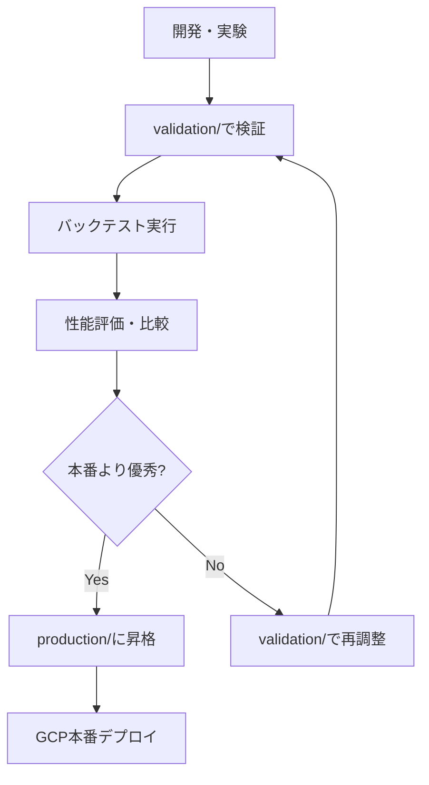

# config/ - 設定管理システム・環境別構成管理

## 📋 概要

**Multi-Environment Configuration Management System**  
本フォルダは crypto-bot プロジェクトの全設定ファイル（34個）を環境別・用途別に体系管理する統合設定システムです。

## 🎯 設計原則

### **環境分離 (Environment Separation)**
- **本番環境**: production/ - GCP Cloud Run稼働・リアルトレード設定
- **開発環境**: development/ - ローカル開発・テスト用設定
- **検証環境**: validation/ - バックテスト・昇格候補管理・実験用設定
- **動的生成**: dynamic_backtest/ - 自動生成・日付ベース設定

### **設定統一性 (Configuration Consistency)**
```
本番稼働 ← 昇格 ← バックテスト検証 ← 実験・開発
production/  validation/     development/
```

## 📁 ディレクトリ構成

```
config/
├── production/         # 本番環境用設定（1ファイル）
├── development/        # 開発環境用設定（4ファイル）
├── validation/         # 検証・バックテスト用設定（26ファイル）
├── dynamic_backtest/   # 動的生成設定（2ファイル）
├── core/              # システム基盤設定（4ファイル）
├── api_versions.json  # API バージョン管理
└── README.md          # 設定管理ガイド
```

## 🚀 本番環境設定 (`production/` - 1ファイル)

**Phase 18対応・エントリーシグナル生成問題修正・データ取得最適化**

### ✅ `production.yml` - **現在の本番稼働設定** (2025年8月10日最終更新)
```yaml
# Phase 18: エントリーシグナル生成問題の根本解決
# 2025年8月10日修正: confidence_threshold=0.35に統一
backtest:
  starting_balance: 10000.0  # ¥10,000スタート
bitbank:
  day_trading:
    enabled: true            # 信用取引有効
    interest_rate: 0.0004    # 建玉金利
  fee_optimization:
    maker_fee: -0.0002       # メイカー手数料（リベート）
    prefer_maker: true       # メイカー優先戦略
data:
  since_hours: 96           # 96時間分のデータ取得（Phase 18修正）
  multi_timeframe_data:
    base_timeframe: 1h      # 1時間足に統一（Phase 18修正）
ml:
  confidence_threshold: 0.35 # 全体統一閾値（Phase 18修正）
  ensemble:
    confidence_threshold: 0.35 # アンサンブル閾値統一
strategy:
  confidence_threshold: 0.35 # 戦略閾値統一
data:
  exchange: bitbank
  limit: 400               # データ取得レコード数
  api_key: ${BITBANK_API_KEY}
  api_secret: ${BITBANK_API_SECRET}
```

**本番設定の特徴**:
- **97特徴量システム**: 外部API依存除去・30重複特徴量削除・効率化達成
- **GCP Cloud Run対応**: Docker環境・環境変数・リソース最適化
- **Bitbank信用取引**: メイカー優先・手数料最適化・リスク管理統合
- **品質監視**: データ品質・エラー耐性・緊急停止機構完備

## 🔧 開発環境設定 (`development/` - 4ファイル)

**ローカル開発・テスト・実験用設定**

### **主要設定ファイル**
- **`default.yml`**: システム標準設定・新規作成時のベースライン・包括的設定テンプレート
- **`bitbank_config.yml`**: Bitbank特化開発設定・production設定ベース・調整自由
- **`local_trading.yml`**: ローカル環境取引テスト用・開発者向け実験設定
- **`bitbank_10k_front_test.yml`**: フロントランニングテスト・特殊検証用

### **開発環境の特徴**
```yaml
# development/default.yml 例
data:
  # exchange: bybit          # Bybit設定（コメントアウト）
  # symbol: BTC/USDT         # 非アクティブ設定
  # api_key: ${BYBIT_TESTNET_API_KEY}  # テストネット対応
```

**使用場面**:
- **新機能開発**: ML戦略・特徴量追加・アルゴリズム実験
- **ローカルテスト**: デバッグ・動作確認・設定調整
- **プロトタイピング**: 新しいアイデア・手法の検証

## 🧪 検証・バックテスト用設定 (`validation/` - 26ファイル)

**本番昇格候補・バックテスト・実験用設定管理システム**

### 🎯 **97特徴量システム検証設定**
- **`unified_97_features_backtest.yml`**: 97特徴量最適化システム総合検証・本番昇格前最終テスト
- **`simple_97_backtest.yml`**: 97特徴量軽量検証・迅速テスト用
- **`production_97_backtest.yml`**: 本番production.yml設定のバックテスト版・完全一致検証

### 📊 **特徴量比較・効果測定設定**
- **`unified_127_features_backtest.yml`**: 127特徴量比較検証・効率化効果測定・Phase前後比較
- **`bitbank_125features_production_backtest.yml`**: 125特徴量版・旧システム比較用
- **`bitbank_124features_production_backtest.yml`**: 124特徴量版・段階的検証用
- **`bitbank_101features_csv_backtest.yml`**: 101特徴量CSV高速テスト

### ⚡ **高速検証・収益性テスト設定**
- **`fast_production_validation_backtest.yml`**: 本番設定高速検証・迅速品質確認
- **`quick_profit_test.yml`**: 収益性迅速検証・短期間パフォーマンステスト
- **`profitable_validation_backtest.yml`**: 収益性重視・利益最大化設定
- **`aggressive_trading_test.yml`**: アグレッシブ戦略・高頻度取引テスト

### 🎛️ **最適化・実験用設定**
- **`ensemble_trading.yml`**: アンサンブル学習専用・TradingEnsembleClassifier・trading_stacking手法
- **`bitbank_optimized_045_threshold.yml`**: 信頼度閾値最適化版・エントリー条件調整
- **`robust_model_backtest.yml`**: 堅牢性検証・市場変動耐性テスト
- **`improved_model_backtest.yml`**: モデル改善版・最新アルゴリズム検証

### 📅 **期間別・時系列検証設定**
- **`7day_backtest_2024_12.yml`**: 短期7日間集中テスト・2024年12月データ
- **`july_2025_performance_test.yml`**: 2025年7月パフォーマンステスト
- **`production_simulation_2025.yml`**: 2025年本番シミュレーション設定
- **`production_trading_enabled.yml`**: 本番取引有効化設定・実取引準備用

### 🔧 **技術検証・統合テスト設定**
- **`api_migration_validation.yml`**: API移行検証・外部データ統合テスト
- **`bitbank_production_validation_backtest.yml`**: Bitbank本番環境検証・接続テスト
- **`mtf_ensemble_test.yml`**: マルチタイムフレーム・アンサンブル統合テスト
- **`production_validation_csv_backtest.yml`**: 本番CSV検証・データ整合性確認

### 📋 **管理・リファレンス用**
- **`api_versions.json`**: 各取引所APIバージョン管理・互換性追跡
- **`jpy_backtest_config.yml`**: JPY建て統一設定・通貨ペア標準化
- **`realistic_21_features_backtest.yml`**: 軽量21特徴量・現実的設定検証

## 🔄 設定ファイル使用方法

### 🚀 本番稼働（Phase 14.5・97特徴量最適化システム）
```bash
# Phase 14.5本番設定での稼働（97特徴量・GCP最適化）
python -m crypto_bot.main live-bitbank --config config/production/production.yml

# GCP Cloud Run自動デプロイ（CI/CD統合）
gcloud run deploy crypto-bot-service-prod \
  --source . \
  --region=asia-northeast1 \
  --set-env-vars="MODE=live,EXCHANGE=bitbank" \
  --set-secrets="BITBANK_API_KEY=bitbank-api-key:latest,BITBANK_API_SECRET=bitbank-api-secret:latest"

# 本番環境ヘルスチェック
curl https://crypto-bot-service-prod-11445303925.asia-northeast1.run.app/health
```

### 🧪 バックテスト・検証（昇格候補テスト）
```bash
# Phase 14.5: 97特徴量システム総合検証
python -m crypto_bot.main backtest --config config/validation/unified_97_features_backtest.yml

# 特徴量効率化効果比較（127 vs 97）
python -m crypto_bot.main backtest --config config/validation/unified_127_features_backtest.yml

# アンサンブル学習検証（TradingEnsembleClassifier）
python -m crypto_bot.main backtest --config config/validation/ensemble_trading.yml

# 高速収益性検証・迅速品質確認
python -m crypto_bot.main backtest --config config/validation/quick_profit_test.yml

# 本番設定完全一致検証
python -m crypto_bot.main backtest --config config/validation/production_97_backtest.yml
```

### 🔧 開発・ローカルテスト
```bash
# 標準開発設定でのテスト
python -m crypto_bot.main live-bitbank --config config/development/default.yml

# Bitbank特化開発設定
python -m crypto_bot.main live-bitbank --config config/development/bitbank_config.yml

# ローカル取引テスト設定
python -m crypto_bot.main live-bitbank --config config/development/local_trading.yml
```

### 📅 動的バックテスト（自動生成）
```bash
# Phase 4.2: 動的日付調整システム実行
python scripts/phase42_adjusted_backtest.py
# → config/dynamic_backtest/production_simulation_until_YYYYMMDD.yml 自動生成

# 生成された動的設定でのバックテスト
python -m crypto_bot.main backtest --config config/dynamic_backtest/production_simulation_until_20250807.yml
```

## 📋 設定昇格ワークフロー・今後の展開

### 🎯 **設定昇格フロー（バックテスト→本番）**
1. **検証フェーズ**: `validation/`で新設定のバックテスト実行
2. **性能評価**: 収益性・勝率・シャープレシオを既存本番設定と比較
3. **昇格判定**: 優秀な結果確認後、`production/`にコピー・適用
4. **本番移行**: GCP環境でのデプロイ・実稼働開始


## 📦 システム基盤設定 (`core/` - 4ファイル)

**特徴量順序・システム基盤管理**

### **基盤管理ファイル**
- **`feature_order.json`**: 97特徴量順序定義・ML学習・推論時の特徴量一致保証
- **`feature_order.json.backup`**: バックアップファイル・重要度最高・復旧用
- **`feature_order.checksum`**: 整合性チェックサム・データ破損検出
- **`optimized_97_features.json`**: 最適化97特徴量定義・Phase 14.5対応

### **特徴量順序システム**
```json
{
  "feature_order": [
    "open", "high", "low", "close", "volume",  // OHLCV基本
    "close_lag_1", "close_lag_3",             // ラグ特徴量
    "returns_1", "returns_2", "returns_3",    // リターン系
    "ema_5", "ema_10", "ema_20",              // EMA系
    // ... 97特徴量完全定義
  ]
}
```

## 🔄 動的設定システム (`dynamic_backtest/` - 2ファイル)

**Phase 4.2: 動的日付調整システム・自動生成設定管理**

### **自動生成システム**
- **`README.md`**: 動的生成システム説明・運用ガイド
- **`production_simulation_until_YYYYMMDD.yml`**: 日付ベース自動生成設定

### **動的生成の特徴**
```bash
# 実行日ベースの自動設定生成
# 例：2025年8月7日実行 → production_simulation_until_20250806.yml
# - 前日（8月6日）まで自動データ取得
# - 未来データ完全排除・時系列整合性保証
# - 30日間バックテスト期間・継続運用対応
```

## 🎯 設定昇格ワークフロー・Phase 14.5対応

### **設定昇格フロー（バックテスト→本番）**


1. **実験フェーズ**: `development/`での新設定開発・機能追加・アルゴリズム実験
2. **検証フェーズ**: `validation/`での包括的バックテスト・性能測定・比較分析
3. **評価フェーズ**: 収益性・勝率・シャープレシオ・ドローダウンを現行本番設定と比較
4. **昇格判定**: 全指標で優秀な結果確認後、`production/production.yml`へ昇格適用
5. **本番移行**: GCP Cloud Run環境での自動デプロイ・リアルトレード開始

### **Phase 14.5新機能統合ロードマップ**
- ✅ **97特徴量システム**: 外部API無効化・30重複特徴量削除・効率化達成
- ✅ **GCPリソース最適化**: CPU/Memory削減・コスト50%削減・段階的実施
- 🔄 **アンサンブル学習強化**: `ensemble_trading.yml`→本番統合準備
- 🔄 **マルチタイムフレーム最適化**: 15m/1h/4h統合・予測精度向上
- 🔮 **複数通貨ペア対応**: ETH/JPY・XRP/JPY拡張・ポートフォリオ分散

## ⚠️ 重要事項・管理原則

### 🔐 **設定変更時の注意事項**
1. **production/**: GCP本番稼働中・変更は最大限慎重に・必ずバックアップ作成必須
2. **validation/**: バックテスト検証用・昇格候補管理・実験自由・26ファイル管理
3. **development/**: ローカル開発用・完全自由・新機能実験・プロトタイピング
4. **core/**: システム基盤・feature_order.json変更は全システム影響・慎重対応必須

### 🎯 **Phase 14.5環境整合性**
- **production.yml**: GCP Cloud Run完全対応・Docker最適化・リソース最適化済み
- **validation/**: 本番環境と設定構造完全一致・昇格時の整合性100%保証
- **環境変数**: `${BITBANK_API_KEY}`・`${BITBANK_API_SECRET}`・GCP Secret Manager統合
- **CI/CD統合**: GitHub Actions・Terraform・自動品質チェック・デプロイ統合

### 📁 **ファイル管理・運用原則**
- **新規追加**: バックテスト設定は`validation/`に配置・実験用途は`development/`
- **昇格適用**: 検証済み優秀設定を`production/`にコピー・バックアップ後適用
- **削除禁止**: 本番稼働中設定の削除は絶対禁止・`validation/`は実験自由
- **バックアップ**: 本番設定変更前は必ず日付付きバックアップ作成・復旧保証
- **履歴管理**: `dynamic_backtest/`は自動生成・過去設定は履歴として保持

---

**Phase 14.5: 97特徴量最適化・GCPリソース最適化・設定管理システム統合完了**により、crypto-botの設定管理は完全に体系化・自動化されました。34個の設定ファイルによる包括的環境管理システムを確立しています。🚀⚙️