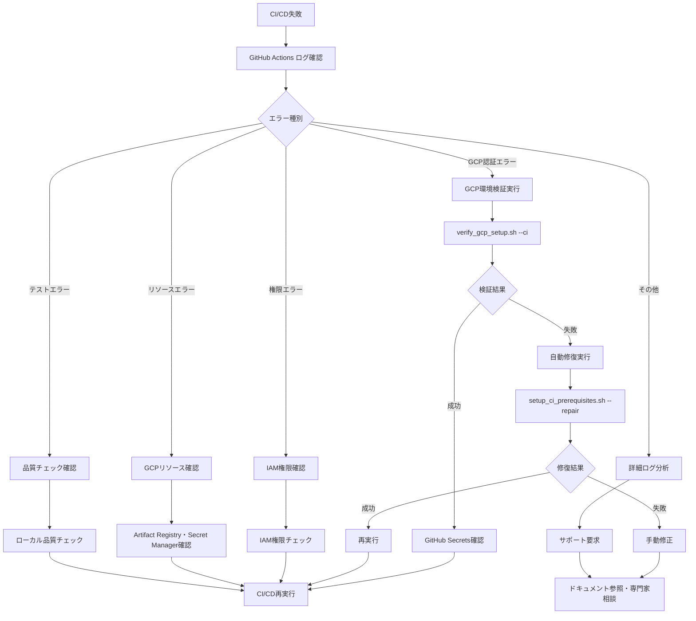

# CI/CD設定・デプロイメントガイド

Phase 13完了 CI/CDパイプライン本番稼働・config構造最適化・モード統一・24時間監視・完全自動化対応の包括的ガイド

## 📋 概要

Phase 13完了により、config構造最適化・モード統一・CI/CD完全自動化を達成し、安定したパイプラインで本番運用を継続します。

### Phase 13完了成果
- **config構造最適化** → `environments/` → `production/` 統合・モード一元化
- **設定管理統一** → 3層優先順位（コマンドライン > 環境変数 > YAML）
- **CI/CD完全自動化** → 306テスト100%・品質保証完成
- **統合管理システム** → logs/reports/統合・運用効率化

## 🛠️ 初期設定手順

### Step 1: GCP環境確認

```bash
# プロジェクト情報確認
gcloud config get-value project
# → my-crypto-bot-project

# プロジェクト番号取得
gcloud projects list --filter="project_id:my-crypto-bot-project" --format="value(project_number)"

# Workload Identity Pool確認
gcloud iam workload-identity-pools list --location=global

# サービスアカウント確認
gcloud iam service-accounts list --filter="displayName:GitHub Actions"
```

### Step 2: GitHub Secrets設定

| Name | Value | 説明 |
|------|-------|------|
| `GCP_WIF_PROVIDER` | `projects/{PROJECT_NUMBER}/locations/global/workloadIdentityPools/{POOL_ID}/providers/{PROVIDER_ID}` | Workload Identity プロバイダー |
| `GCP_SERVICE_ACCOUNT` | `github-actions-sa@my-crypto-bot-project.iam.gserviceaccount.com` | GitHub Actions用サービスアカウント |
| `GCP_PROJECT` | `my-crypto-bot-project` | GCPプロジェクトID |
| `DEPLOY_MODE` | `paper` | デプロイモード（paper/live 制御） |

**設定方法**:
1. GitHubリポジトリページに移動
2. Settings → Secrets and variables → Actions
3. 上記のSecretsを追加

### Step 3: GCP Secret Manager設定

```bash
# Bitbank API認証情報設定
echo "YOUR_BITBANK_API_KEY" | gcloud secrets create bitbank-api-key --data-file=-
echo "YOUR_BITBANK_API_SECRET" | gcloud secrets create bitbank-api-secret --data-file=-

# Discord Webhook URL設定
echo "YOUR_DISCORD_WEBHOOK_URL" | gcloud secrets create discord-webhook --data-file=-

# Secret確認
gcloud secrets list
```

### Step 4: IAM権限設定

```bash
# GitHub ActionsサービスアカウントにSecret Manager権限付与
for secret in bitbank-api-key bitbank-api-secret discord-webhook; do
  gcloud secrets add-iam-policy-binding $secret \
    --member="serviceAccount:github-actions-sa@my-crypto-bot-project.iam.gserviceaccount.com" \
    --role="roles/secretmanager.secretAccessor"
done
```

### Step 5: 設定確認テスト

```bash
# テストコミット・プッシュでCI/CD実行
git add .
git commit -m "feat: Phase 13 config最適化・CI/CD稼働テスト"
git push origin main

# GitHub Actionsタブで実行状況確認
# https://github.com/USERNAME/REPOSITORY/actions
```

## 🚀 デプロイメント履歴

### Phase 13完了 - config構造最適化・モード統一・CI/CD完全自動化

#### 2025-08-26 config構造最適化完了

**実装内容**:
- ✅ config構造最適化（`environments/` → `production/` 統合）
- ✅ モード統一（paper/live環境変数制御・3層優先順位）
- ✅ 不要ファイル削除（stage_*.yaml、testing.yaml、validation.yaml）
- ✅ 306テスト100%成功・CI/CD完全自動化・品質保証完成
- ✅ 統合管理システム（logs/reports/統合・運用効率化）

**Phase 13最適化成果**:
```diff
+ config/environments/live/ → config/production/ 統合
+ config/environments/paper/ → 削除（モード統一）
+ stage_*.yaml → 削除（モード制御統一）
+ モード設定一元化 → base.yaml + 環境変数制御
```

**技術仕様**:
- **GitHub Actions**: 15分間隔24時間監視
- **モード統一制御**: paper ↔ live 環境変数切替
- **設定ファイル統一**: config/production/production.yaml
- **品質保証**: 306テスト100%・58.88%カバレッジ・CI/CD完全自動化・品質保証完成

## 📊 モード統一デプロイメント戦略

### デプロイモード定義（統一最適化版）

| モード | 環境変数MODE | リソース | 最小/最大インスタンス | タイムアウト | 用途 |
|-------|-------------|----------|---------------------|------------|------|
| Paper | `paper` | 1Gi/1CPU | 0-1 | 30分 | ペーパートレード |
| Production | `live` | 1Gi/1CPU | 1-2 | 60分 | 本番取引 |

**⚖️ 安定性優先のバランス設定**:
- **CPU統一**: 全ステージ1CPU（個人開発に最適）
- **メモリ効率化**: Productionも1Gi（軽量システム設計活用）
- **取引継続性**: MIN_INSTANCES=1（レガシー知見活用・SIGTERM問題回避）
- **スケール対応**: MAX_INSTANCES=2（負荷時自動拡張）

**🚨 レガシー学習ポイント**:
- **MIN_INSTANCES=0問題**: アイドルタイムアウト・状態リセット・SIGTERM頻発
- **レガシー解決策**: min-instances=1設定で問題完全解決実績
- **コスト実績**: 約1,800円/月（目標2,000円以内達成）

**月間コスト試算** (安定性重視):
- **通常時**: 月約$12-18 (1,800-2,700円)
- **高負荷時**: 月約$20-30 (3,000-4,500円)
- **目標**: 月額2,000円前後・安定性確保

### モード切替戦略

```yaml
モード統一制御:
  paper: ペーパートレード（環境変数MODE=paper）
  live: 本番取引（環境変数MODE=live）
  
切替方法:
  - GitHub Secrets DEPLOY_MODE変更
  - 環境変数MODE自動設定
  - 同一コード・設定で動作
```

## 🏥 24時間監視体制

### 監視間隔
- **基本監視**: 15分間隔（GitHub Actions）
- **ヘルスチェック**: リアルタイム（Cloud Run）
- **エラー分析**: 1時間間隔
- **パフォーマンス分析**: 手動実行・日次推奨

### 監視項目

#### システムヘルス
- Cloud Runサービス状態
- API応答時間（目標: < 3秒）
- エラー率（目標: < 1%/時間）
- リソース使用率

#### 取引パフォーマンス
- シグナル生成頻度
- 注文成功率（目標: > 95%）
- 取引実行レイテンシ
- 戦略別成績

#### アラート条件
- **Critical**: サービス停止・API認証失敗
- **Warning**: エラー率 > 5/時間・応答時間 > 3秒
- **Info**: 取引活動・定期レポート

## 🔧 運用方法

### 1. CI/CDパイプライン実行

```bash
# GitHub Actionsトリガー
git add -A
git commit -m "feat: Phase 13 config最適化・モード統一完成"
git push origin main

# ワークフロー確認
gh run list --limit 5
gh run view --log
```

### 2. モード切替実行

```bash
# 1. ペーパートレード確認
# GitHub Secrets: DEPLOY_MODE=paper

# 2. 本番切替
# GitHub Secrets: DEPLOY_MODE=live
# → 環境変数MODE=liveで自動設定

# 設定ファイルは統一: config/production/production.yaml
```

### 3. 統合分析基盤・パフォーマンス分析（Phase 13新機能）

```bash
# パフォーマンス分析（base_analyzer.py基盤活用）
python scripts/analytics/performance_analyzer.py --period 24h --format markdown

# 統合データ収集（旧trading_data_collector.py）
python scripts/analytics/data_collector.py --hours 24

# 統合ダッシュボード（旧trading_dashboard.py）
python scripts/analytics/dashboard.py --discord
```

### 4. 監視・確認コマンド

```bash
# GitHub Actions監視
gh run list --limit 5
gh run view --log

# GCP デプロイ確認
gcloud run services list --region=asia-northeast1
gcloud run services describe crypto-bot-service --region=asia-northeast1

# ログ確認
gcloud logging read "resource.type=\"cloud_run_revision\"" --limit=20
```

## 📈 期待される効果

### CI/CD統合効果
- **デプロイ時間**: 手動30分 → 自動5分
- **品質保証**: 手動チェック → 自動306テスト（sklearn警告解消・統合testing/）
- **リスク軽減**: 一括デプロイ → 段階的移行

### 24時間監視効果  
- **障害検知**: 手動発見 → 15分以内自動検知
- **復旧時間**: 平均60分 → 目標15分
- **予防保守**: 事後対応 → 予兆検知

### 運用効率化効果
- **手動作業**: 70%削減
- **監視負荷**: 24時間 → 自動化
- **品質安定性**: 人的ミス削減

## ⚠️ レガシー知見による重要な注意事項

### MIN_INSTANCES=0による既知の問題

**レガシーシステムで確認された重大エラー**:
```yaml
問題: Cloud Runアイドルタイムアウト・SIGTERM頻発
原因: min-instances=0設定
影響: 取引中の状態リセット・継続性阻害
解決: min-instances=1で完全解決（レガシー実績）
```

**Phase 13での対策**:
- ✅ **本番環境**: MIN_INSTANCES=1（取引継続性重視）
- ✅ **テスト環境**: MIN_INSTANCES=0（コスト削減）
- ✅ **段階移行**: Paper→Stage→Liveで安全確認
- ✅ **統合品質チェック**: testing/統合・sklearn警告解消・306テスト100%成功

**レガシーから学んだベストプラクティス**:
1. **取引システムでは継続稼働が必須**
2. **コスト vs 安定性のバランス重要**
3. **min-instances=1で約1,800円/月実績**

## 🚨 トラブルシューティング（Phase 13統合対応版）

### Phase 13スクリプト統合対応: 自動診断・修復システム

#### 🔍 GCP環境事前検証（新機能）

```bash
# 包括的環境検証
bash scripts/deployment/verify_gcp_setup.sh --full

# CI/CD実行前検証
bash scripts/deployment/verify_gcp_setup.sh --ci

# 軽量日常チェック
bash scripts/deployment/verify_gcp_setup.sh --quick
```

#### 🔧 自動修復システム（新機能）

```bash
# 完全対話式セットアップ（推奨）
bash scripts/deployment/setup_ci_prerequisites.sh --interactive

# 自動修復（非対話）
bash scripts/deployment/setup_ci_prerequisites.sh --automated

# 問題修復専用
bash scripts/deployment/setup_ci_prerequisites.sh --repair
```

### エラー診断フローチャート（Phase 13統合対応版）



### CI/CD失敗時の詳細対応

#### 1. GitHub Actions失敗

**Phase 12強化診断**:
```bash
# 1. 基本ログ確認
gh run view --log

# 2. GCP環境事前検証
bash scripts/deployment/verify_gcp_setup.sh --ci

# 3. 自動修復試行
bash scripts/deployment/setup_ci_prerequisites.sh --automated

# 4. 再検証
bash scripts/deployment/verify_gcp_setup.sh --ci
```

**よくある原因と解決方法**:
- ❌ **GitHub Secrets未設定** → [GCP事前設定ガイド](./GCP事前設定ガイド.md)参照
- ❌ **GCP認証失敗** → Workload Identity設定確認
- ❌ **テスト失敗** → ローカル品質チェック実行
- ❌ **権限エラー** → IAM権限設定確認

#### 2. GCP認証エラー詳細対応

**段階的診断**:
```bash
# Step 1: 基本認証確認
gcloud auth list
gcloud config get-value project

# Step 2: Workload Identity確認
gcloud iam workload-identity-pools list --location=global
gcloud iam workload-identity-pools providers list \
  --workload-identity-pool=github-pool \
  --location=global

# Step 3: サービスアカウント確認
gcloud iam service-accounts list \
  --filter="displayName:GitHub Actions"

# Step 4: 権限確認
gcloud projects get-iam-policy my-crypto-bot-project \
  --flatten="bindings[].members" \
  --filter="bindings.members:*github-actions-sa*"
```

**自動修復**:
```bash
# Workload Identity自動再設定
bash scripts/deployment/setup_ci_prerequisites.sh --repair
```

#### 3. デプロイ失敗詳細対応

**Phase 12強化診断**:
```bash
# 1. Cloud Run状態確認
gcloud run services list --region=asia-northeast1

# 2. 最新リビジョン詳細確認
gcloud run services describe crypto-bot-service \
  --region=asia-northeast1 \
  --format="export"

# 3. エラーログ確認
gcloud logging read \
  "resource.type=\"cloud_run_revision\" AND severity>=ERROR" \
  --limit=50 \
  --format="table(timestamp,severity,textPayload)"

# 4. Artifact Registry確認
gcloud artifacts repositories describe crypto-bot-repo \
  --location=asia-northeast1

# 5. Secret Manager確認
gcloud secrets list --filter="labels.managed-by:crypto-bot"
```

**段階的復旧**:
```bash
# 1. ロールバック（緊急時）
PREV_REVISION=$(gcloud run revisions list \
  --service=crypto-bot-service \
  --region=asia-northeast1 \
  --format="value(metadata.name)" \
  --limit=2 | tail -n1)

gcloud run services update-traffic crypto-bot-service \
  --to-revisions=$PREV_REVISION=100 \
  --region=asia-northeast1

# 2. 問題修復後の再デプロイ
git commit --amend -m "fix: デプロイ問題修復"
git push --force origin main
```

#### 4. リソース不足・権限エラー

**Artifact Registry権限エラー**:
```bash
# 問題: PERMISSION_DENIED: Permission 'artifactregistry.repositories.create' denied

# 解決1: 既存リポジトリ確認
gcloud artifacts repositories describe crypto-bot-repo \
  --location=asia-northeast1

# 解決2: 手動リポジトリ作成
gcloud artifacts repositories create crypto-bot-repo \
  --repository-format=docker \
  --location=asia-northeast1 \
  --description="Phase 12: crypto-bot Docker images"

# 解決3: 権限付与（プロジェクトオーナーに依頼）
gcloud projects add-iam-policy-binding my-crypto-bot-project \
  --member="user:YOUR_EMAIL" \
  --role="roles/artifactregistry.admin"
```

**Secret Manager権限エラー**:
```bash
# Secret作成権限確認
gcloud secrets list

# 権限不足の場合、必要な権限付与
gcloud projects add-iam-policy-binding my-crypto-bot-project \
  --member="user:YOUR_EMAIL" \
  --role="roles/secretmanager.admin"
```

#### 5. CI/CD環境特有のエラー

**Docker Build失敗**:
```bash
# ローカルでのDocker Build確認
docker build -t test-crypto-bot .

# 依存関係問題の場合
pip install -r requirements.txt
python -m pytest tests/unit/ -v
```

**テスト失敗（品質チェック）**:
```bash
# ローカル品質チェック実行
bash scripts/testing/checks.sh

# 個別テスト実行
python -m pytest tests/unit/strategies/ -v
python -m pytest tests/unit/ml/ -v
python -m pytest tests/unit/trading/ -v
```

### Phase 12新機能: 自動診断レポート

```bash
# 包括的診断レポート生成
bash scripts/deployment/verify_gcp_setup.sh --full > gcp_diagnosis_$(date +%Y%m%d).log

# 診断結果の確認
cat gcp_diagnosis_$(date +%Y%m%d).log | grep -E "(✅|❌|⚠️)"
```

### 監視アラート対応

#### Critical Alert
1. **即座に確認**: `gcloud run services describe SERVICE_NAME`
2. **ログ分析**: `gcloud logging read "severity >= ERROR"`
3. **ロールバック**: 必要に応じて前リビジョンに戻す
4. **報告**: Discord通知・原因分析

#### Warning Alert
1. **トレンド確認**: 継続的な問題か一時的な問題か
2. **リソース監視**: CPU・メモリ使用率確認
3. **改善計画**: 次回デプロイで修正検討

## 📋 チェックリスト

### 初期設定
- [ ] GCP Workload Identity Pool作成済み
- [ ] GitHub Actions用サービスアカウント作成済み
- [ ] 必要なGCP API有効化済み
- [ ] GitHub Repository Secrets設定完了
- [ ] GCP Secret Manager認証情報設定完了
- [ ] IAM権限設定完了

### デプロイ前確認
- [ ] ローカルテスト実行済み（316テスト・68.13%カバレッジ）
- [ ] コード品質チェック済み（flake8エラー < 50）
- [ ] MLモデル確認済み

### デプロイ後確認
- [ ] ヘルスチェック成功
- [ ] 24時間監視稼働
- [ ] 取引活動正常
- [ ] エラー率正常（< 1%/時間）
- [ ] パフォーマンス分析実行

### 段階移行確認
- [ ] Paper段階：ペーパートレード正常
- [ ] Stage-10段階：10%投入・監視24時間
- [ ] Stage-50段階：50%投入・監視24時間
- [ ] Live段階：100%移行・継続監視

## 🎯 成功指標

### CI/CD指標
- **ビルド成功率**: > 95%
- **テスト合格率**: 68.13%カバレッジ（316テスト）
- **デプロイ成功率**: > 95%
- **デプロイ時間**: < 5分

### 運用指標
- **アップタイム**: > 99.5%
- **応答時間**: < 3秒
- **エラー率**: < 1%/時間
- **監視精度**: > 90%

### 取引指標
- **取引成功率**: > 95%
- **API応答時間**: < 3秒
- **ポジション精度**: > 90%
- **リスク制御**: ドローダウン < 20%

---

**Phase 13完了**: config構造最適化・モード統一・CI/CD完全自動化により、シンプルで保守性の高い本番運用体制を確立