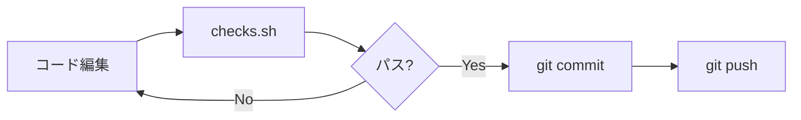
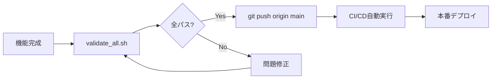

# 検証ワークフローガイド

## 📋 概要

crypto-botでは、コード品質と本番環境での安定性を保証するため、3段階の検証システムを採用しています。

## 🎯 使い分けガイド

### 1. **開発中の頻繁なチェック** → `checks.sh`
```bash
# コード編集後、コミット前に実行
bash scripts/checks.sh
```
- **実行時間**: 〜1分
- **内容**: flake8, isort, black, pytest
- **いつ使う**: 
  - コード編集後
  - コミット前
  - PR作成前

### 2. **デプロイ前の包括検証** → `validate_all.sh`
```bash
# 本番デプロイ前に実行（フル検証）
bash scripts/validate_all.sh

# 開発中の中間チェック（高速版）
bash scripts/validate_all.sh --quick

# CI/CD用（静的解析+リーク検出）
bash scripts/validate_all.sh --ci
```
- **実行時間**: 
  - `--quick`: 〜1分
  - `--ci`: 〜3分
  - フル: 〜10分
- **いつ使う**:
  - 本番デプロイ前（必須）
  - 大きな機能追加後
  - 週次の定期チェック

### 3. **個別の詳細検証** → 各専用スクリプト
```bash
# 未来データリーク検出のみ
python scripts/utilities/future_leak_detector.py --project-root .

# ペーパートレードのみ
python -m crypto_bot.main live-bitbank --paper-trade

# シグナルモニタリングのみ
python scripts/utilities/signal_monitor.py
```

## 📊 検証レベル詳細

### **Level 1: 静的解析（必須）**
- ✅ 構文エラーチェック
- ✅ コードスタイル統一
- ✅ import順序
- ✅ ユニットテスト
- ✅ カバレッジ測定

### **Level 2: 時系列検証（重要）**
- 🔍 未来データリーク検出
- 🔍 特徴量計算の時系列整合性
- 🔍 バックテストのデータ分割
- 🔍 危険なパターンの検出

### **Level 3: 動的検証（包括的）**
- 🎯 ペーパートレード実行
- 🎯 シグナル生成監視
- 🎯 システム統合テスト
- 🎯 本番環境シミュレーション

## 🚀 推奨ワークフロー

### **日常開発フロー**


### **本番デプロイフロー**


## ⚠️ 重要な注意事項

### **絶対にスキップしてはいけない検証**
1. **本番デプロイ前の`validate_all.sh`**
   - 未来データリークは本番で大損失につながる
   - ペーパートレードで事前にエラーを発見

2. **大きな変更後の`checks.sh`**
   - テストの失敗は他の部分に影響する
   - カバレッジ低下は品質低下のサイン

### **検証失敗時の対処**

#### Level 1失敗（静的解析）
```bash
# 自動修正を適用
python -m black crypto_bot/ tests/
python -m isort crypto_bot/ tests/

# 再チェック
bash scripts/checks.sh
```

#### Level 2失敗（リーク検出）
```bash
# 詳細レポートを確認
open logs/leak_detection/leak_detection_*.html

# 危険なパターンを修正
# 例: shift(-1) → shift(1)
#     rolling(center=True) → rolling()
```

#### Level 3失敗（動的検証）
```bash
# 個別レポートを確認
open logs/pre_deploy_validation/validation_*.html
open logs/monitoring_reports/signal_monitor_*.html

# ログを詳細確認
tail -f logs/trading_signals.csv
tail -f logs/paper_trading_results.json
```

## 📈 パフォーマンス最適化

### **並列実行（上級者向け）**
```bash
# 複数の検証を並列実行
(
    bash scripts/checks.sh &
    python scripts/utilities/future_leak_detector.py --project-root . &
    wait
) && echo "All parallel checks passed"
```

### **増分検証（開発効率化）**
```bash
# 変更されたファイルのみチェック
git diff --name-only | grep '\.py$' | xargs python -m flake8
git diff --name-only | grep '\.py$' | xargs python -m black --check
```

## 🔧 トラブルシューティング

### **Q: checks.shが遅い**
A: pytestのカバレッジ計算が原因。開発中は以下で高速化：
```bash
# カバレッジなしでテスト実行
pytest tests/unit/ -x --tb=short
```

### **Q: validate_all.shがタイムアウトする**
A: ペーパートレードが原因の可能性。スキップ可能：
```bash
python scripts/pre_deploy_validation.py --skip-paper-trade
```

### **Q: 未来データリーク検出で誤検知が多い**
A: 安全なパターンはホワイトリストに追加：
```python
# scripts/utilities/future_leak_detector.py の safe_patterns に追加
"safe_patterns": [
    r"your_safe_pattern_here",
]
```

## 📚 関連ドキュメント

- [README.md](../README.md) - プロジェクト概要
- [CLAUDE.md](../CLAUDE.md) - 開発ガイドライン
- [scripts/README.md](../scripts/README.md) - スクリプト詳細

## 🎯 ゴールデンルール

1. **コミット前に`checks.sh`を必ず実行**
2. **本番デプロイ前に`validate_all.sh`を必ず実行**
3. **検証失敗を無視しない**
4. **警告も可能な限り解消する**
5. **定期的に全検証を実行する（週1回推奨）**

---

*最終更新: 2025年8月11日 - Phase 2-3実装完了*